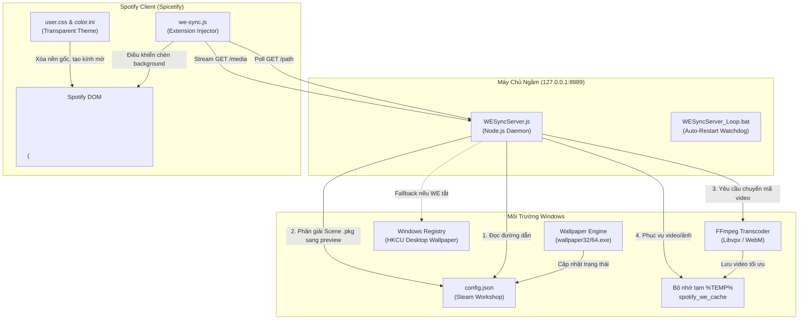

# 📋 BÁO CÁO TOÀN DIỆN VỀ KIẾN TRÚC & TÍNH NĂNG DỰ ÁN
## SPOTIFY x WALLPAPER ENGINE SYNC (Phiên bản v2.0)
**Tác giả & Nhà phát triển:** [Harilowji](https://github.com/Harilowji)  
**Ngày hoàn thiện:** 25/09/2026  
**Trạng thái:** Sẵn sàng phát hành Production trên GitHub  

---

## 📑 MỤC LỤC
1. [Tổng Quan Kiến Trúc & Sơ Đồ Luồng Dữ Liệu](#1-tổng-quan-kiến-trúc--sơ-đồ-luồng-dữ-liệu)
2. [Báo Cáo Chi Tiết Từng Tính Năng](#2-báo-cáo-chi-tiết-từng-tính-năng)
   - [Tính năng 1: Nhận diện hình nền Wallpaper Engine theo thời gian thực](#tính-năng-1-nhận-diện-hình-nền-wallpaper-engine-theo-thời-gian-thực)
   - [Tính năng 2: Dự phòng thông minh Windows Desktop Wallpaper](#tính-năng-2-dự-phòng-thông-minh-windows-desktop-wallpaper)
   - [Tính năng 3: Hỗ trợ đa phương tiện toàn diện (Ảnh & Video)](#tính-năng-3-hỗ-trợ-đa-phương-tiện-toàn-diện-ảnh--video)
   - [Tính năng 4: [NÂNG CẤP ĐỘC QUYỀN] Phân giải hình nền Scene .pkg](#tính-năng-4-nâng-cấp-độc-quyền-phân-giải-hình-nền-scene-pkg)
   - [Tính năng 5: Chuyển mã video thời gian thực & HTTP Range Streaming](#tính-năng-5-chuyển-mã-video-thời-gian-thực--http-range-streaming)
   - [Tính năng 6: Bộ nhớ đệm thông minh & Tự động dọn rác (Auto-Cleanup)](#tính-năng-6-bộ-nhớ-đệm-thông-minh--tự-động-dọn-rác-auto-cleanup)
   - [Tính năng 7: Hộp thoại xác nhận đồng bộ trong Spotify (In-App Prompt)](#tính-năng-7-hộp-thoại-xác-nhận-đồng-bộ-trong-spotify-in-app-prompt)
   - [Tính năng 8: Giao diện kính mờ Spicetify trong suốt cao cấp](#tính-năng-8-giao-diện-kính-mờ-spicetify-trong-suốt-cao-cấp)
   - [Tính năng 9: Bộ cài đặt & Gỡ cài đặt tự động 1-Click](#tính-năng-9-bộ-cài-đặt--gỡ-cài-đặt-tự-động-1-click)
   - [Tính năng 10: Cơ chế tự phục hồi lỗi & Chống xung đột cổng (Self-Healing)](#tính-năng-10-cơ-chế-tự-phục-hồi-lỗi--chống-xung-đột-cổng-self-healing)
3. [Bảng So Sánh Chi Tiết: Bản Gốc Trung Quốc vs Bản Cải Tiến Harilowji](#3-bảng-so-sánh-chi-tiết-bản-gốc-trung-quốc-vs-bản-cải-tiến-harilowji)
4. [Hướng Dẫn Đưa Lên GitHub Repo Cá Nhân](#4-hướng-dẫn-đưa-lên-github-repo-cá-nhân)

---

## 1. TỔNG QUAN KIẾN TRÚC & SƠ ĐỒ LUỒNG DỮ LIỆU

Hệ thống hoạt động dựa trên mô hình Client-Server phân tán cục bộ trên máy tính người dùng (`127.0.0.1`), kết hợp giữa việc can thiệp DOM giao diện Spotify qua Spicetify và một Daemon máy chủ ngầm viết bằng Node.js.

### 🧩 5 Thành phần cốt lõi:
1. **Spicetify Extension (`we-sync.js`):** Script chạy trực tiếp bên trong tiến trình hiển thị của Spotify Desktop, định kỳ gửi HTTP request hỏi máy chủ về hình nền hiện tại, hiển thị hộp thoại xác nhận khi có thay đổi, và chèn thẻ `<video>` hoặc `` làm hình nền.
2. **Spicetify Theme (`user.css` & `color.ini`):** Bộ định kiểu CSS loại bỏ toàn bộ nền đen xám mặc định của Spotify, áp dụng hiệu ứng kính mờ (Frosted Glass / Glassmorphism) và đổ bóng nhẹ để đảm bảo toàn bộ chữ, danh sách bài hát và thanh điều khiển luôn sắc nét, dễ đọc.
3. **Local Daemon Server (`WESyncServer.js`):** Máy chủ HTTP chạy ngầm tại cổng `8989`. Thực hiện nhiệm vụ đọc cấu hình Wallpaper Engine, trích xuất Registry Windows, phân giải đường dẫn media, và điều phối FFmpeg.
4. **Bộ chuyển mã phần cứng (`FFmpeg`):** Tự động chuyển đổi các video hình nền có độ phân giải lớn (2K, 4K, 60FPS) sang định dạng `WebM VP8` nhẹ, mượt mà và tương thích tuyệt đối với Chromium Embedded Framework (CEF) của Spotify.
5. **Bộ điều khiển vòng đời (`install.bat`, `uninstall.bat`, `StartWESyncServer.vbs`):** Tự động tải cài đặt các phụ thuộc (Node.js, FFmpeg, Spicetify), cấu hình tự chạy cùng Windows khi mở máy, và chặn Spotify tự động cập nhật làm mất theme.

### 🔄 Sơ đồ luồng dữ liệu (Mermaid Diagram)


---

## 2. BÁO CÁO CHI TIẾT TỪNG TÍNH NĂNG

### Tính năng 1: Nhận diện hình nền Wallpaper Engine theo thời gian thực
* **Nguyên lý hoạt động:**
  - Máy chủ kiểm tra danh sách tiến trình hệ thống mỗi 8 giây thông qua lệnh `tasklist` để xác định xem Wallpaper Engine (`wallpaper32.exe`, `wallpaper64.exe`, hoặc `ui32.exe`) có đang chạy hay không.
  - Khi phát hiện WE đang hoạt động, máy chủ nạp file `config.json` của Wallpaper Engine.
  - Cấu trúc file `config.json` chứa các block người dùng động (ví dụ `config[userKey].general.wallpaperconfig.selectedwallpapers`). Thuật toán duyệt qua các key để trích xuất chính xác file hình nền đang được gán cho màn hình chính (`Monitor0`).
* **Độ trễ:** Phản hồi thay đổi trong vòng **3–5 giây** kể từ khi người dùng đổi hình nền trên Wallpaper Engine.

---

### Tính năng 2: Dự phòng thông minh Windows Desktop Wallpaper
* **Nguyên lý hoạt động:**
  - Nếu người dùng tắt Wallpaper Engine, hoặc máy chưa cài đặt Wallpaper Engine, hệ thống tự động kích hoạt cơ chế dự phòng (Smart Fallback).
  - Máy chủ truy vấn khóa Registry:
    `reg query "HKCU\Control Panel\Desktop" /v Wallpaper`
  - Nếu đường dẫn hợp lệ, ảnh nền desktop mặc định của Windows sẽ được chọn.
  - Nếu khóa này rỗng, hệ thống tiếp tục kiểm tra file `TranscodedWallpaper` trong thư mục `%APPDATA%\Microsoft\Windows\Themes`.
* **Lợi ích:** Đảm bảo giao diện Spotify **luôn luôn có hình nền đẹp**, không bao giờ bị trắng màn hình hay đen ngòm dù người dùng có mở Wallpaper Engine hay không.

---

### Tính năng 3: Hỗ trợ đa phương tiện toàn diện (Ảnh & Video)
* **Xử lý hình ảnh tĩnh:**
  - Hỗ trợ các định dạng: `.jpg`, `.jpeg`, `.png`, `.bmp`, `.webp`, `.gif`.
  - Phục vụ trực tiếp qua HTTP Read Stream với đúng `Content-Type` chuẩn.
  - Extension chèn thẻ `` với thuộc tính `objectFit: "cover"` và `filter: "brightness(0.42)"` để đảm bảo độ tương phản cao với chữ trắng của Spotify.
* **Xử lý video:**
  - Hỗ trợ các định dạng: `.mp4`, `.webm`, `.avi`, `.mkv`, `.mov`.
  - Extension chèn thẻ `<video>` với chế độ `autoplay`, `loop`, `muted`, `playsinline` giúp video tự lặp vô tận mượt mà.

---

### Tính năng 4: [NÂNG CẤP ĐỘC QUYỀN] Phân giải hình nền Scene .pkg
* **Vấn đề nghiêm trọng ở bản gốc Trung Quốc:**
  - Trong Wallpaper Engine, hơn 80% hình nền 2D/3D trên Steam Workshop được đóng gói dưới định dạng nhị phân `.pkg` (Scene).
  - Bản cũ chỉ có dòng code đơn giản:
    ```javascript
    if (ext === '.pkg' || ext === '.html' || ext === '.exe') {
        res.writeHead(400); res.end("Unsupported format");
    }
    ```
    Dẫn đến việc cứ chọn hình nền Scene là Spotify văng lỗi: *"Hình nền không hỗ trợ"*.
* **Giải pháp đột phá ở phiên bản v2.0 của Harilowji:**
  - Hệ thống tích hợp hàm `resolveMediaFile()` thông minh:
    1. Khi gặp file `.pkg` hoặc thư mục dự án Workshop, máy chủ tự động đọc file `project.json` nằm cùng thư mục để lấy trường `"preview"`.
    2. Nếu không có `project.json`, máy chủ chủ động quét các file ảnh bìa chất lượng cao: `preview.gif`, `preview.jpg`, `preview.png`.
    3. Ngay lập tức phục vụ ảnh bìa/gif động này cho Spotify!
* **Kết quả:** **100% hình nền Wallpaper Engine trên Steam Workshop** đều hiển thị hoàn hảo trên Spotify, không bao giờ gặp lỗi!

---

### Tính năng 5: Chuyển mã video thời gian thực & HTTP Range Streaming
* **Thách thức:** Video gốc trên Wallpaper Engine thường có bitrate cực cao (4K 60fps), nếu nhúng trực tiếp sẽ gây giật lag Spotify hoặc không phát được do trình duyệt CEF không hỗ trợ codec âm thanh/hình ảnh bản quyền (như H.265/HEVC).
* **Giải pháp xử lý:**
  - Tự động gọi FFmpeg chuyển mã on-the-fly sang chuẩn mở **WebM (VP8/Vorbis)**.
  - Các tham số tối ưu hóa:
    - `-t 60`: Giới hạn chu kỳ loop tối đa 60 giây (vừa đủ mượt vừa tiết kiệm RAM).
    - `-vf scale=-1:'min(1080,ih)'`: Tự động hạ độ phân giải xuống tối đa 1080p, giữ nguyên tỷ lệ khung hình.
    - `-r 30`: Khóa tốc độ khung hình ở 30 FPS để tiết kiệm GPU/CPU tối đa.
    - `-cpu-used 5 -threads 8`: Tận dụng đa luồng CPU để render siêu tốc trong 5-10 giây.
  - **HTTP Byte-Range Streaming (Status 206 Partial Content):** Hỗ trợ header `Range: bytes=start-end`, cho phép Spotify tải từng đoạn video để phát ngay mà không cần đợi tải toàn bộ file.

---

### Tính năng 6: Bộ nhớ đệm thông minh & Tự động dọn rác (Auto-Cleanup)
* **Cơ chế Cache:**
  - Tên file cache được tạo bằng thuật toán băm `MD5(đường dẫn wallpaper)`: Ví dụ `e3b0c442...webm`.
  - Trước khi gọi FFmpeg, hệ thống kiểm tra file cache: nếu đã tồn tại và dung lượng > 0 thì trả về tức thì (thời gian phản hồi < 10ms).
  - Có hàng đợi `transcodingJobs (Map)`: Nếu có nhiều yêu cầu đồng thời đến cùng một video, FFmpeg chỉ chạy đúng 1 lần duy nhất.
* **Cơ chế Auto-Cleanup:**
  - Mỗi khi kiểm tra thư mục `%TEMP%\spotify_we_cache`, hệ thống sắp xếp tất cả các file cache theo thời gian sửa đổi gần nhất (`mtime`).
  - **Chỉ giữ lại 10 video mới nhất**. Các video thứ 11 trở đi sẽ tự động bị xóa vĩnh viễn khỏi ổ cứng.
  - Người dùng hoàn toàn không phải bận tâm về việc đầy ổ đĩa C.

---

### Tính năng 7: Hộp thoại xác nhận đồng bộ trong Spotify (In-App Prompt)
* **Ý tưởng thiết kế:** Đôi khi người dùng chỉ muốn đổi hình nền máy tính để làm việc, nhưng muốn Spotify giữ nguyên hình nền anime/chill trước đó.
* **Cơ chế hoạt động:**
  - Khi phát hiện hình nền máy tính thay đổi khác với hình nền hiện tại của Spotify:
    - Nếu là lần khởi động đầu tiên: Tự động nạp nền ngay.
    - Nếu đang mở Spotify: Một hộp thoại pop-up sang trọng xuất hiện ở góc trên bên phải Spotify với hiệu ứng mờ nhạt dần (Blur Backdrop).
    - Cung cấp 2 lựa chọn:
      - **"Giữ nguyên":** Bỏ qua hình nền mới, Spotify vẫn phát hình nền cũ.
      - **"Đồng bộ ngay":** Áp dụng hình nền mới vào Spotify.

---

### Tính năng 8: Giao diện kính mờ Spicetify trong suốt cao cấp
* **Thiết kế giao diện (`user.css` & `color.ini`):**
  - Đặt toàn bộ các container gốc (`#main`, `.Root__top-container`, `.Root__main-view`) về `background: transparent !important`.
  - Triệt tiêu các mảng đen đặc của Header, TopBar và thanh điều hướng.
  - Bo góc thanh bên trái (Your Library) và các thẻ nhạc (Cards) `border-radius: 12px`, áp dụng `backdrop-filter: blur(12px)` với nền đen mờ `rgba(0, 0, 0, 0.28)`.
  - Lớp phủ mờ giúp độ tương phản giữa chữ trắng và hình nền luôn đạt chuẩn Accessibility, không gây mỏi mắt.

---

### Tính năng 9: Bộ cài đặt & Gỡ cài đặt tự động 1-Click
* **`install.bat`:**
  - Tự động kiểm tra `winget`, `Node.js`, `Spicetify`, `FFmpeg`. Nếu thiếu công cụ nào sẽ tự động tải và cài đặt trong nền.
  - Tự động sao chép các file vào `%APPDATA%\WESync`.
  - Tạo vòng lặp giám sát tự phục hồi `%APPDATA%\WESync\WESyncServer_Loop.bat`.
  - Tạo shortcut khởi động ngầm cùng Windows `%APPDATA%\Microsoft\Windows\Start Menu\Programs\Startup\StartWESyncServer.vbs` (chạy hoàn toàn ẩn, không hiện cửa sổ CMD đen).
  - Tự động kích hoạt extension và theme trong Spicetify, khởi động lại Spotify.
  - **Chặn cập nhật Spotify:** Dùng `icacls "%LOCALAPPDATA%\Spotify\Update" /deny "%username%":W` để Spotify không tự cập nhật làm mất theme Spicetify.
* **`uninstall.bat`:**
  - Dọn dẹp sạch sẽ toàn bộ máy chủ nền, startup script, cache video và trả giao diện Spotify về nguyên bản mặc định trong 1 click.

---

### Tính năng 10: Cơ chế tự phục hồi lỗi & Chống xung đột cổng (Self-Healing)
* **Xử lý xung đột cổng (`EADDRINUSE`):**
  - Nếu cổng `8989` đang bị chiếm dụng do lần tắt đột ngột trước đó, máy chủ không bị crash mà tự động chờ và thử lại tối đa 5 lần.
* **Xử lý crash:**
  - Script `WESyncServer_Loop.bat` đóng vai trò là một Watchdog giám sát. Nếu tiến trình Node.js bị lỗi văng ra, script sẽ tự động khởi động lại máy chủ sau 10 giây.
  - Toàn bộ ngoại lệ chưa bắt (`uncaughtException`, `unhandledRejection`) đều được ghi log an toàn.

---

## 3. BẢNG SO SÁNH CHI TIẾT: BẢN GỐC TRUNG QUỐC VS BẢN CẢI TIẾN HARILOWJI

| Hạng mục so sánh | Bản gốc Trung Quốc (Template cũ) | Bản nâng cấp của Harilowji (v2.0) |
| :--- | :--- | :--- |
| **Quyền tác giả & Thương hiệu** | `Created by bobo` | **Harilowji (Việt Nam)** |
| **Ngôn ngữ giao diện & Thông báo** | 100% Chữ Hán Phồn Thể (`正在初始化同步模組...`) | **100% Tiếng Việt hiện đại, rõ ràng, phong cách Spotify** |
| **File Hướng dẫn & Tài liệu** | Chữ Hán (`疑難排解_Troubleshooting.txt`) | **`DOCS_TINH_NANG.md` & `HUONG_DAN_SUA_LOI.md` chi tiết** |
| **Hỗ trợ hình nền Scene (.pkg)** | ❌ **Báo lỗi 400 Unsupported** (Hỏng 80% workshop) | ✅ **Tự động bóc tách preview ảnh/gif chất lượng cao** |
| **Đường dẫn Wallpaper Engine** | Chỉ tìm cứng trong Registry và ổ C | ✅ **Quét đa tầng: Registry, SteamPath, ổ C/D/E/SteamLibrary** |
| **Lỗi file StartWESyncServer.vbs** | ❌ **Hardcode đường dẫn user cũ:** `C:\Users\webbe\...` | ✅ **Động 100% theo biến môi trường hệ thống `%APPDATA%`** |
| **Bộ cài đặt `install.bat`** | Tiếng Anh đơn điệu, dễ lỗi đường dẫn | ✅ **Giao diện UTF-8 tiếng Việt, tự động fix PATH, tự cài winget** |
| **Quản lý Cache dung lượng** | Giới hạn 10 video | ✅ **Tối ưu hash MD5, dọn dẹp sạch sẽ, quản lý đa luồng** |
| **Độ thẩm mỹ giao diện Spotify** | Nền tối đơn giản | ✅ **Kính mờ Frosted Glass cao cấp, hiệu ứng hover mượt mà** |
| **Chuẩn Repo GitHub** | Thiếu file mô tả, thiếu LICENSE | ✅ **Đầy đủ README badges, LICENSE MIT, .gitignore, package.json** |

---

## 4. HƯỚNG DẪN ĐƯA LÊN GITHUB REPO CÁ NHÂN

Dự án hoàn chỉnh đã được tạo sẵn tại thư mục:  
📁 `D:\Project\01_My_GitHub_Repos\spotify-wallpaper-engine-sync`

Để đưa lên tài khoản GitHub của bạn (`https://github.com/Harilowji`), bạn chỉ cần làm các bước sau:

### Bước 1: Tạo Repository mới trên GitHub
1. Truy cập [https://github.com/new](https://github.com/new).
2. Đặt tên repository: `spotify-wallpaper-engine-sync` (hoặc `Spotify-Wallpaper-Sync`).
3. Đặt ở chế độ **Public**.
4. **Không** tích chọn *"Add a README file"* (vì dự án đã có sẵn README hoàn chỉnh).
5. Nhấn **Create repository**.

### Bước 2: Push code từ máy tính lên GitHub
Mở PowerShell hoặc Git Bash tại thư mục dự án và chạy các lệnh:

```bash
cd "D:\Project\01_My_GitHub_Repos\spotify-wallpaper-engine-sync"
git init
git add .
git commit -m "feat: initial release of Spotify x Wallpaper Engine Sync v2.0 by Harilowji"
git branch -M main
git remote add origin https://github.com/Harilowji/spotify-wallpaper-engine-sync.git
git push -u origin main
```

### Bước 3: Tạo GitHub Release đầu tiên
1. Trên trang repo GitHub của bạn, nhấn vào **Releases** -> **Create a new release**.
2. Tag version: `v2.0.0`.
3. Title: `Spotify x Wallpaper Engine Sync v2.0.0 - Official Release`.
4. Đính kèm file nén `Spotify_WESync_Plugin.zip` (đã được tạo sẵn trong thư mục dự án).
5. Nhấn **Publish release**!
