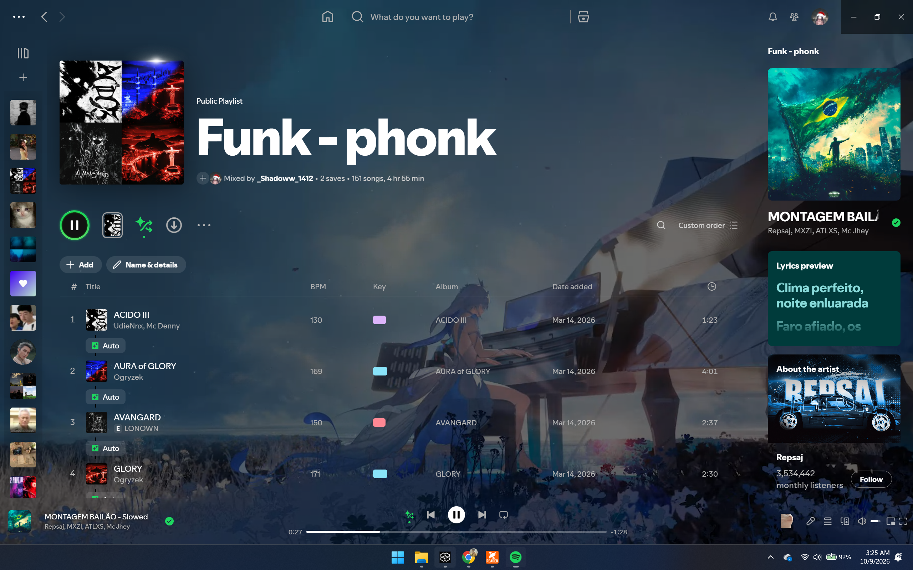

# 🎵 Spotify x Wallpaper Engine Sync v2.5

<div align="center">



<br/>

[](https://github.com/Harilowji/spotify-wallpaper-engine-sync/stargazers)
[](https://github.com/Harilowji/spotify-wallpaper-engine-sync/network/members)
[](https://github.com/Harilowji/spotify-wallpaper-engine-sync/releases)
[](https://www.microsoft.com/windows)
[](https://spicetify.app/)
[](LICENSE)

<br/>

**Biến giao diện Spotify thành một tác phẩm nghệ thuật sống động — Tự động đồng bộ hình nền động & tĩnh từ Wallpaper Engine hoặc Windows Desktop với hiệu ứng kính mờ (Frosted Glass) siêu mượt!**

[✨ Tính Năng Nổi Bật](#-tính-năng-nổi-bật) • [📥 Cách Tải & Cài Đặt](#-hướng-dẫn-tải--cài-đặt-chi-tiết) • [🔄 Khắc Phục Khi Spotify Update](#-khi-spotify-tự-cập-nhật-thì-làm-sao) • [🗑️ Gỡ Cài Đặt](#-gỡ-cài-đặt) • [English Quickstart](#-english-quickstart)

</div>

---

## 🌟 Tính Năng Nổi Bật

### 1. 🔄 Đồng Bộ Thời Gian Thực (Real-time Live Sync)
* **Tự động nhận diện:** Liên tục theo dõi hình nền đang phát trên Wallpaper Engine (mọi màn hình) và cập nhật ngay vào nền Spotify chỉ sau **3–5 giây**.
* **Smart Windows Fallback:** Khi bạn tắt Wallpaper Engine, hệ thống tự động chuyển sang hình nền Desktop của Windows. Spotify của bạn sẽ không bao giờ bị đen hay trống trải!

### 2. 🎬 Hỗ Trợ Đa Phương Tiện & Phân Giải Scene (.pkg) Độc Quyền
* **Video & Ảnh:** Tương thích mượt mà với mọi định dạng: `MP4`, `WebM`, `MKV`, `AVI`, `MOV`, `PNG`, `JPG`, `WEBP`, `GIF`.
* **Smart Scene Resolver:** Tự động giải mã và trích xuất ảnh bìa/animation chất lượng cao từ các hình nền dạng Scene (`.pkg` / `project.json`) của Steam Workshop.

### 3. ⚡ Chuyển Mã Tức Thì & Tiết Kiệm Phần Cứng (FFmpeg On-the-Fly)
* Tự động nén và chuyển mã video 2K/4K sang định dạng `WebM VP8` tối ưu (1080p, 30 FPS).
* Công nghệ **HTTP Byte-Range Streaming** (Status 206) phát video ngay lập tức với mức tiêu thụ CPU & GPU cực thấp.
* **Bộ nhớ đệm thông minh (Auto Cache Cleaner):** Tự động băm mã MD5 và chỉ lưu tối đa 10 hình nền gần nhất, tự dọn dẹp các file cũ trong `%TEMP%\spotify_we_cache`, đảm bảo không lo đầy ổ cứng.

### 4. 💎 Giao Diện Kính Mờ Trong Suốt Đỉnh Cao (Frosted Glass Theme)
* Xóa sạch các khối nền hộp đen đục ngầu truyền thống của Spotify.
* Hiệu ứng kính mờ **Glassmorphism** sang trọng cho thanh danh sách phát (Left Sidebar), thanh điều khiển (Player Bar) và khung lời bài hát (Lyrics).
* **Trang Nghệ sĩ (Artist Page) trong suốt:** Tích hợp hiệu ứng cuộn mờ dần mượt mà, hòa quyện tự nhiên cùng hình nền động.

### 5. 🐱 Chi Tiết Tùy Chỉnh Độc Đáo
* **Icon chú mèo đáng yêu:** Tích hợp icon mèo trắng sinh động ngay cạnh biểu tượng micro, căn chỉnh tỉ lệ 36px chuẩn xác.
* **Cover Art 42px tinh chỉnh:** Kích thước ảnh bìa bài hát được tối ưu không bị vỡ hạt và không bị tràn viền khi bạn phóng to cửa sổ Spotify.

### 6. 🛡️ Kháng Cập Nhật Tự Động (Auto-Healer Sentinel)
* Dịch vụ ngầm liên tục giám sát trạng thái Spicetify. Nếu Spotify tự ý cập nhật làm mất mod, hệ thống sẽ tự động phục hồi lại giao diện chỉ sau 5 giây mà không cần bạn phải thao tác lại từ đầu.

---

## 📥 Hướng Dẫn Tải & Cài Đặt Chi Tiết

Dành cho tất cả mọi người khi truy cập GitHub của dự án!

### 📋 Điều kiện cần chuẩn bị:
1. **Hệ điều hành:** Windows 10 hoặc Windows 11 (64-bit).
2. **Spotify:** Cài đặt bản **Spotify Desktop truyền thống** tải từ trang chủ [spotify.com/download](https://www.spotify.com/download/windows/).  
   > ⚠️ **LƯU Ý QUAN TRỌNG:** Bản tải từ **Microsoft Store** sẽ **KHÔNG** hoạt động do chính sách cô lập ứng dụng (sandbox) của Windows. Nếu đang dùng bản Store, bạn hãy gỡ ra và tải file `.exe` từ web Spotify nhé!
3. *(Tùy chọn)*: **Wallpaper Engine** trên Steam.

---

### 🚀 Cách 1: Tải nhanh trực tiếp từ GitHub (Khuyên dùng - Đơn giản nhất)

1. Nhấp vào nút xanh **`Code`** ở góc trên bên phải trang GitHub này -> Chọn **`Download ZIP`**  
   *(Hoặc tải file nén `.zip` từ mục [Releases](https://github.com/Harilowji/spotify-wallpaper-engine-sync/releases))*.
2. Chuột phải vào file `.zip` vừa tải về -> Chọn **`Extract All...` (Giải nén toàn bộ)** ra một thư mục bất kỳ trên máy tính (ví dụ: `Desktop` hoặc ổ `D:`).  
   > ⚠️ **Chú ý:** Không nhấp đúp chạy trực tiếp từ trong file nén `.zip`, phải giải nén ra thư mục bình thường trước!
3. Mở thư mục vừa giải nén, nhấp đúp vào file **`install.bat`**.
4. Trình cài đặt tự động sẽ làm mọi thứ cho bạn:
   - Tự động kiểm tra và tải các công cụ hỗ trợ (`Node.js`, `FFmpeg`, `Spicetify CLI` qua `winget` nếu máy chưa có).
   - Thiết lập máy chủ ngầm tự khởi động cùng Windows.
   - Nạp theme kính mờ và extension đồng bộ vào Spotify.
5. Khi màn hình hiện thông báo **"CHÚC MỪNG! BẠN ĐÃ CÀI ĐẶT THÀNH CÔNG!"**, hãy mở Spotify lên và tận hưởng!

---

### 💻 Cách 2: Dành cho Developer (Sử dụng Git)

Nếu bạn đã cài sẵn Git trên máy tính, chỉ cần mở Terminal / CMD và gõ:

```bash
# 1. Clone repository về máy
git clone https://github.com/Harilowji/spotify-wallpaper-engine-sync.git

# 2. Truy cập vào thư mục dự án
cd spotify-wallpaper-engine-sync

# 3. Chạy file cài đặt tự động
install.bat
```

---

## 🔄 Khi Spotify Tự Cập Nhật Thì Làm Sao?

Khi Spotify tự nâng cấp phiên bản mới, giao diện tùy chỉnh có thể tạm thời bị đưa về mặc định của Spotify. Bạn đừng lo lắng:

* **Tự động:** Trình ngầm WESync sẽ tự phát hiện và kích hoạt khôi phục lại cho bạn.
* **Thủ công 1-Click:** Bạn chỉ cần vào thư mục dự án và nhấp đúp vào file **`check_update.bat`** (hoặc chạy lại `install.bat`), toàn bộ giao diện sẽ trở lại bình thường trong tích tắc!

---

## 🗑️ Gỡ Cài Đặt (Uninstall)

Nếu bạn muốn đưa Spotify về lại giao diện gốc ban đầu:
1. Mở thư mục dự án.
2. Nhấp đúp vào file **`uninstall.bat`**.
3. Toàn bộ tiến trình nền, cache video và theme tùy chỉnh sẽ được gỡ bỏ hoàn toàn sạch sẽ trong 3 giây.

---

## 🌍 English Quickstart

### Prerequisites
* Windows 10 / 11 (64-bit).
* Standard Spotify Desktop client from [spotify.com/download](https://www.spotify.com/download/windows/) (Microsoft Store version is **not** supported).
* *(Optional)* Wallpaper Engine on Steam.

### 1-Click Installation
1. Click **Code** -> **Download ZIP** (or get it from [Releases](https://github.com/Harilowji/spotify-wallpaper-engine-sync/releases)).
2. Extract the ZIP archive completely.
3. Double-click **`install.bat`**.
4. The automated installer will download required dependencies (`Node.js`, `FFmpeg`, `Spicetify`) via Windows Package Manager (`winget`), register the background daemon, and inject the theme.
5. Launch Spotify and enjoy your synchronized live wallpaper!

---

## 🛠️ Công Nghệ Sử Dụng (Tech Stack)

* **Node.js:** Máy chủ nền siêu nhẹ, giám sát registry Windows & Wallpaper Engine IPC.
* **FFmpeg:** Chuyển mã video đa luồng on-the-fly sang WebM (VP8/Vorbis).
* **Spicetify CLI:** Can thiệp DOM và tiêm CSS / JS vào client Spotify.
* **Vanilla JavaScript & CSS3:** Tùy biến giao diện kính mờ và xử lý video không độ trễ.
* **Windows Batch & VBScript:** Khởi chạy ngầm mượt mà cùng hệ điều hành.

---

## 👤 Tác Giả & Đóng Góp

Dự án được nghiên cứu, tối ưu hóa và phát triển bởi:  
**Harilowji**  
* 🐙 **GitHub:** [@Harilowji](https://github.com/Harilowji)
* 📧 **Email:** [hloitran2007@gmail.com](mailto:hloitran2007@gmail.com)
* 💡 *Nếu bạn thấy dự án hữu ích, hãy tặng một ngôi sao ⭐ (Star) trên GitHub để ủng hộ mình nhé!*

---

## 📄 Bản Quyền (License)

Dự án được phát hành theo giấy phép **[MIT License](LICENSE)**. Tự do sử dụng, chỉnh sửa và chia sẻ.
